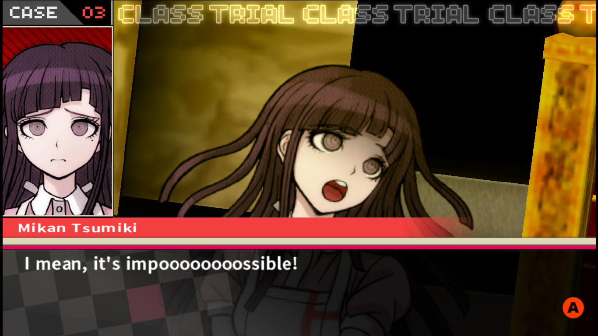
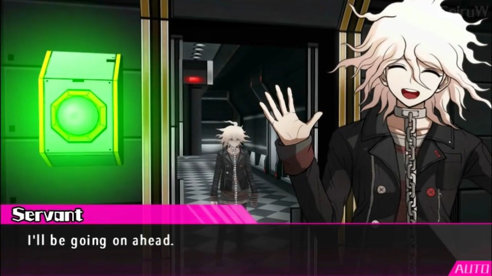
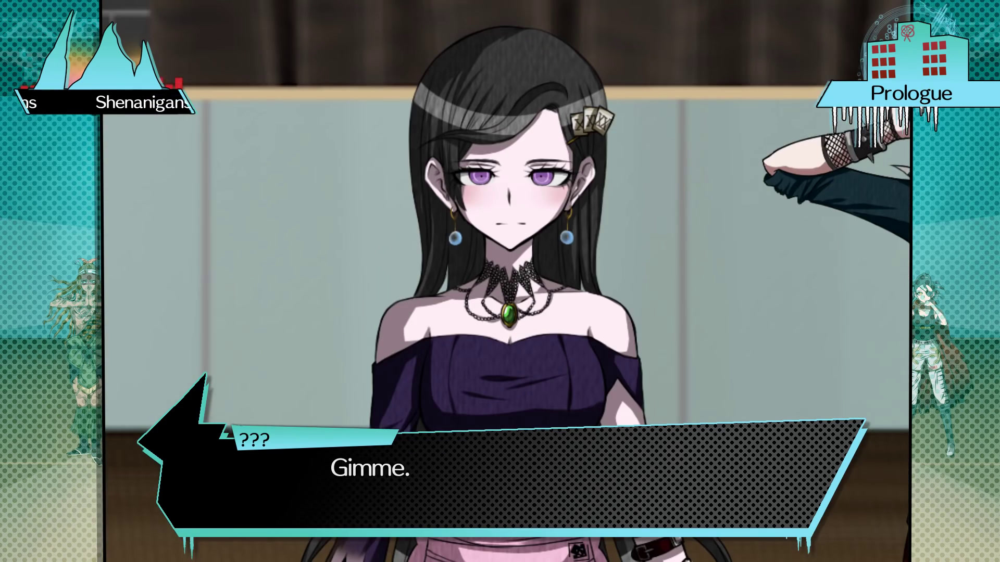

# Danganronpa: Back and Forth
_#Danganronpa-inspired #SVG #CSS_

This was an attempt at recreating Danganronpa transition effects.

Danganronpa games are known for their 2.5D style, I liked their transition effect, so I tried to recreate it using SVG and CSS.

---

This animation is inspired by Danganronpa in general and Danganronpa F specifically.  
Notice how the camera switches (_back and forth_) between the black-haired girl (Cancel) and the red-haired one (Moraiteru):
- Example 1: Camera switching between Cancel and Moraiteru (timestamp 23:18):
[Danganronpa F: Shattered Hope - Prologue (Full)](https://youtu.be/EGU4w5C_WKI?list=PLw3Hoj70YKZBdEBcpDKu8GiXG_WBVysrp&t=1398)

One of Danganronpa F creators made a video tutorial about it.
They use After Effects, but their techniques can be employed in other contexts, like Web technologies.
- Tutorial 1: [Panning and Camera - Fanganronpa Tutorial (AE)](https://www.youtube.com/watch?v=iOlk6GDzS8M)


## Notes

- Something like this could be used with [Monogatari](https://monogatari.io), a Web visual novel engine.

- SVG felt like a good choice. It was easy to imagine the animation could be made using its primitives (mainly `symbol` and `viewBox`).

- Sadly, SVG did not handle 3D transforms (`translateZ`), so I ended up hacking something using HTML and CSS.

- Tested with Microsoft Edge (Chromium) 120.


## Pseudocode

```js
const script = [
    {
        speaker: 'Nagito',
        text: 'Sore wa chigau yo~',
    },
    {
        speaker: 'Hajime',
        text: 'Sore wa chigau zo!',
    },
]
```

```html
<svg>
    <g id="world">
        <image id="background" />
        
        <image id="nagito" />
        <image id="hajime" />
    </g>

    <symbol id="camera" viewBox="0 0 500 500">
        <use href="#world" />
    </symbol>
    <use href="#camera" />

    <g id="ui">
        <rect id="speaker-box" />
        <text id="speaker" />
        <rect id="text-box" />
        <text id="text" />
    </g>
</svg>
```


## Design

**Goals**:
- Transition from one sprite to the other and back (hence the name "back and forth").
    * Using `perspective` and `translateZ`.
- Camera overlay.
    * Using `clip-path`.

**Non-goals**:
- Depth of field.
    * Codepen: [Depth of field effect in CSS](https://codepen.io/rupl/pen/jclDf)
- Motion blur.


### UI inspirations

Mikan from Danganronpa 2


Nagito (Servant) from Danganronpa Ultra Despair Girls


Cancel from Danganronpa F



## Impl

My first thought was to use SVG, but due to complications (mainly `translateZ`), I ended up using HTML.

### Using GSAP and the likes

GSAP or any other animation library.

If I recall correctly, I watched a FEM course in 2020 and thought of recreating the DR/F effect using GSAP.
I believe the course was [SVG Essentials & Animation (v2) by Sarah Drasner](https://frontendmasters.com/courses/svg-essentials-animation/). 

### Using SVG

SVG + SMIL or CSS.

Was going to use the following primitives `image` and `text` in addition to `rect` and whatever to build the UI.

Was planning on using `g`roups to designate different layers.

As for the camera, I was planning on utilizing `use` and `symbol` and animating its `viewBox`.

- https://developer.mozilla.org/en-US/docs/Web/SVG/Element/image
- https://developer.mozilla.org/en-US/docs/Web/SVG/Element/text
- https://developer.mozilla.org/en-US/docs/Web/SVG/Element/use
- https://developer.mozilla.org/en-US/docs/Web/SVG/Element/symbol

### Using HTML

Position scene elements absolutely, a la SVG.

Animate stuff using CSS `animation` and `transition`.


## Learning

- [ ] SVG `translateZ`?

    * [ ] [Why is it not possible to use transform: translateZ on svg path element? - Stack Overflow](https://stackoverflow.com/questions/23230218/why-is-it-not-possible-to-use-transform-translatez-on-svg-path-element)
        + No answer as of 2024-01-26.
    
    * [x] SKIM: [The Next Dimension: 3D Transformations — Using SVG with CSS3 and HTML5 — Supplementary Material](https://oreillymedia.github.io/Using_SVG/extras/ch11-3d.html)
        + Visited 2024-01-26 #archived


- [ ] CSS `mask` vs `clip-path`
    - https://developer.mozilla.org/en-US/docs/Web/CSS/mask
    - https://developer.mozilla.org/en-US/docs/Web/CSS/clip-path
    - [ ] READ: Clipping, Masking and Compositing – SVG 1.1 (Second Edition)
    https://www.w3.org/TR/SVG11/masking.html

- [ ] `perspective` vs `transform-style: preserve-3d`
    * https://developer.mozilla.org/en-US/docs/Web/CSS/transform-style

- [ ] `perspective` property vs `perspective` transform function.
    * TLDR: The prop is applied to the parent, while the function is used on the element itself, but how does that change the output?
    * https://developer.mozilla.org/en-US/docs/Web/CSS/perspective
    * https://developer.mozilla.org/en-US/docs/Web/CSS/transform-function/perspective

- [ ] [Why can't I animate custom properties (aka CSS variables)? - Stack Overflow](https://stackoverflow.com/questions/54594167/why-cant-i-animate-custom-properties-aka-css-variables)
    * KAITO: Not needed?


## Credits

### Resources

- **Hexagon pattern**
    * Designed by Kbibibi / Freepik https://www.freepik.com/free-vector/pattern-made-with-outlined-hexagons_836345.htm

- **"Pool at night" background** (screenshot)
  * By [Steam user Civilian](https://steamcommunity.com/id/Civilian_TF2)
  * URL: https://steamcommunity.com/sharedfiles/filedetails/?id=1632900624
  * `dr-screenshot-pool-at-night.jpg`: https://steamuserimages-a.akamaihd.net/ugc/963109604395229997/8271244FF1662E66E4A206A58F2056616129A9C6/

- **Hajime Hinata** (accusing sprite)
  * Taken from Fandom.com: https://danganronpa.fandom.com/wiki/Hajime_Hinata/Sprite_Gallery?file=Hajime_Hinata_Fullbody_Sprite_03.png
   * `dr-sprite-hajime-accusing.png`: https://static.wikia.nocookie.net/danganronpa/images/b/bf/Hajime_Hinata_Fullbody_Sprite_03.png/revision/latest/scale-to-width-down/418?cb=20170816141502

- **Nagito Komaeda** (condescending sprite)
  * Taken from Fandom.com: https://danganronpa.fandom.com/wiki/Nagito_Komaeda/Sprite_Gallery?file=Nagito_Komaeda_Fullbody_Sprite_%252817%2529.png
  * `dr-sprite-nagito-condescending.png`: https://static.wikia.nocookie.net/danganronpa/images/0/07/Nagito_Komaeda_Fullbody_Sprite_%2817%29.png/revision/latest/scale-to-width-down/393?cb=20170816165101

- **Nagito Komaeda** (accusing sprite)
  * Taken from Fandom.com: https://danganronpa.fandom.com/wiki/Nagito_Komaeda/Sprite_Gallery?file=Nagito_Komaeda_Fullbody_Sprite_%252825%2529.png
  * `dr-sprite-nagito-accusing.png`:: https://static.wikia.nocookie.net/danganronpa/images/3/3c/Nagito_Komaeda_Fullbody_Sprite_%2825%29.png/revision/latest/scale-to-width-down/480?cb=20170816165105

### Disclaimer

**DR Back and Forth** is a fan-made demo and is not affiliated with or endorsed by Spike Chunsoft. All intellectual property, including but not limited to characters, names, and assets from the Danganronpa series, are the property of Spike Chunsoft. The use of these assets is done under the belief that it constitutes fair use for the purpose of creating a non-commercial, transformative work. No challenge to the rights of Spike Chunsoft is intended or implied.

**DR Back and Forth** is a non-commercial project created for educational purposes.
